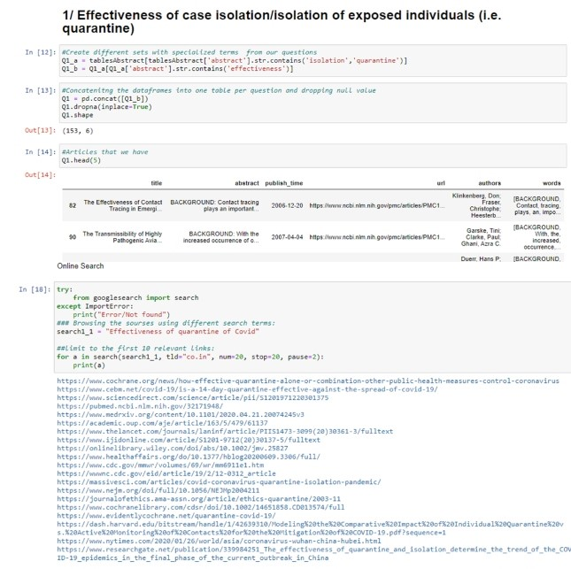
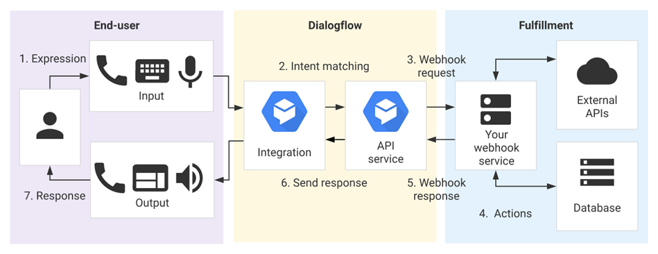
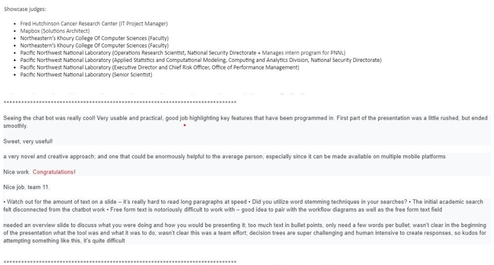

# Interactive Virtual Agents for questions related to COVID-19
The main goal of this project is to bring the scattered information into a single source where the employees, students and esepcially biostatiscians can have access it with one click and have a real time conversation with the agent which provides an accurate information available around the web within seconds. Most of the Datasets are manually entered and it is hard to update the information which is changed on daily bases, so our objective is to connect the API directly to the Chatbot and the Academic Paper Search Engine 

## Academic paper search engine for Biostaticians 
The search engine allows Biostaticians to find relevant research articles from [daily updated Kaggle source](https://www.kaggle.com/allen-institute-for-ai/CORD-19-research-challenge) and Google Search all thanks to predesigned questions. For example, the first question has 153 academic papers and suitable links

  

  

  

## The ChatBot
The General information about Covid-19 is available:
- Screening the symptoms of covid 19 for ourselves or others
- What is Covid 19?
- What are the Symptoms of covid-19?
- How many confirmed cases are there in United States?
Chatbot is also build to respond to the users in 23 different languages
Also gives information about the worldwide confirmed, Death and Recovered patients count as it is going to be auto updated in real time 
This chat bot can be integrated into different platform with respect to the requirement.

## Recommendations for FutureWork 
Academic papers search engine: implement effective NLP deep learning models using 4 different approaches for Text similarities (Text Pre-Processing, Feature Extraction, Vector Similarity, Decision Function)
Integrate academic papers search engine work to the chatbot
Build UI for messaging channels like Slack, Facebook, Telegram
Integrate an SQL or NoSQL database so the training data gets available for future training purposes

## Results and feedbacks 
The judges were seriously impressed by our innovative proposal and we won First Place of the Hackathon. I have included some of the feedbacks below. 
The achievement is suprising given to the fact our team - was the only group that mostly comprised Analytics students from the new Seattle Campus (the other groups had majority representation with Software Development, IT, Computer Science backgrounds that are from older campuses in Boston, Silicon Valley, Toronto).

